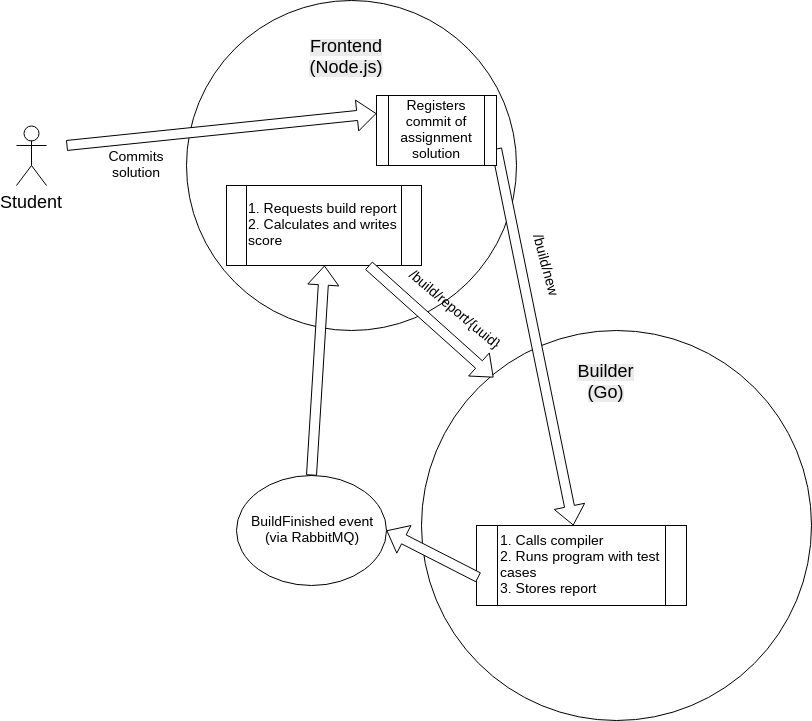

# PSJudge - simple online judge for PS-Group

Work in progress implementation.

## Build&Run

In order to build and run judge you need

* Linux machine
* Node.js
* Go compiler
* RabbitMQ

Use `scripts/install_deps` to install Go and Node.js libraries required to run judge.

Use `scripts/build` to build Go project `builder_service`.

Use `scripts/run` to run both `builder_service` and `frontend_server`.

## Architecture

There are following components:

* `frontend_server` serves HTML/JS/CSS for users
* `builder_service` builds solutions and runs assignment input/output tests

There are following interaction routes:

* `frontend_server` monitors "build finished" events from RabbitMQ
* `builder_service` provides JSON REST API for `frontend_server` and posts "build finished" events to RabbitMQ

Following diagram shows how student solutions served by judge:

